# Platziflix — Arquitectura del Sistema

## Resumen Ejecutivo

**Platziflix** es una plataforma educativa de video streaming compuesta por tres proyectos independientes que comparten una API REST como fuente de datos:

| Proyecto | Tecnología | Propósito |
|----------|-----------|-----------|
| **Backend** | Python 3.11 + FastAPI + PostgreSQL | API REST + base de datos |
| **Frontend** | Next.js 15 + React 19 + TypeScript | Aplicación web |
| **Mobile/Android** | Kotlin + Jetpack Compose | App Android |
| **Mobile/iOS** | Swift + SwiftUI | App iOS |

---

## 1. Big Picture — Vista General del Sistema

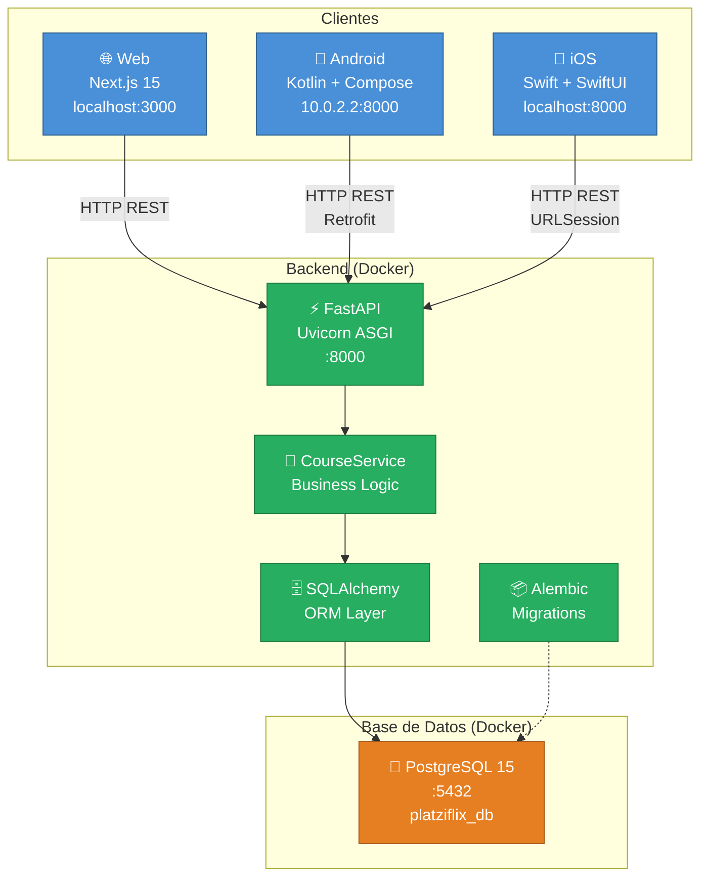

---

## 2. Diagrama de Clases — Backend

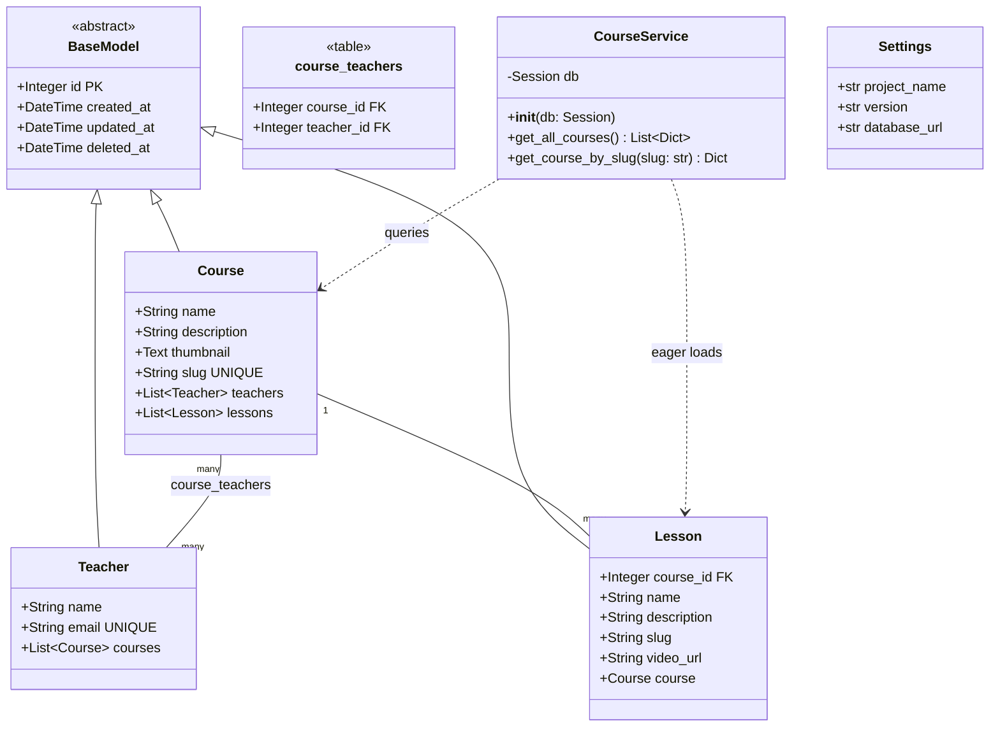

---

## 3. Diagrama de Clases — Frontend (TypeScript)

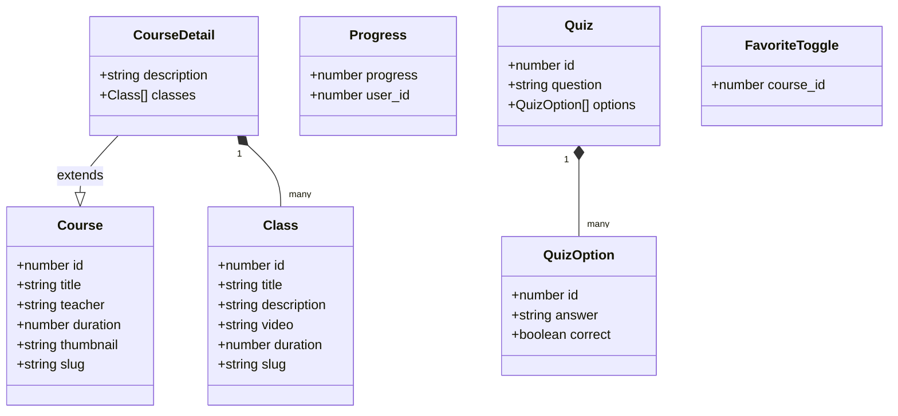

---

## 4. Diagrama de Clases — Android (Kotlin)

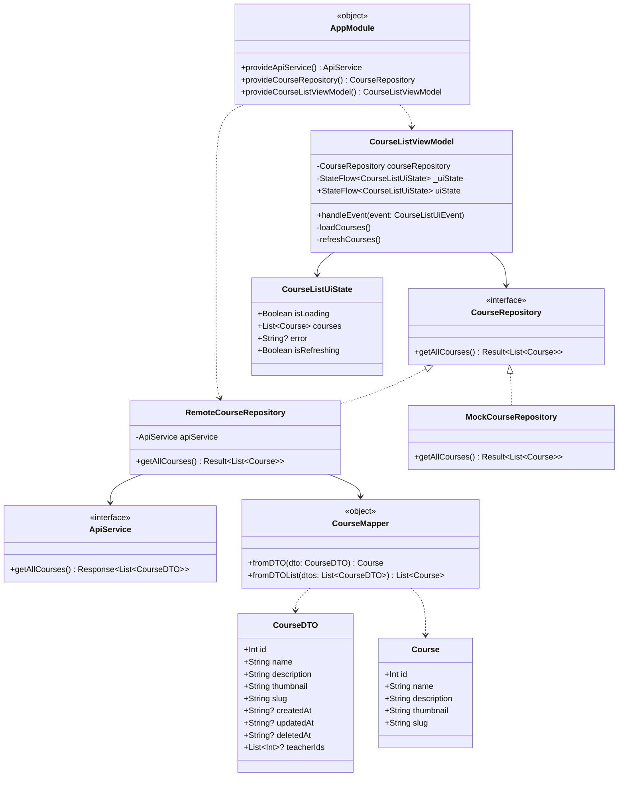

---

## 5. Diagrama de Clases — iOS (Swift)

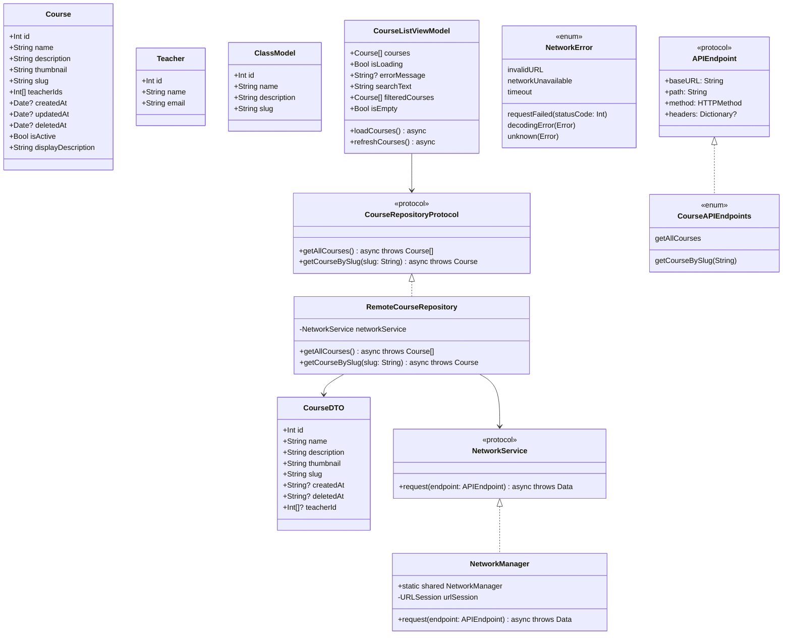

---

## 6. Flujo de Datos — Usuario Web

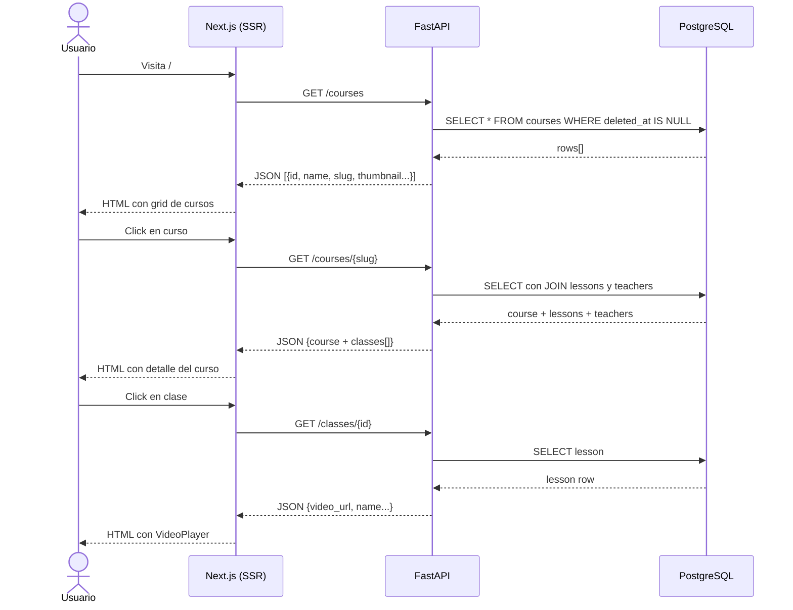

---

## 7. Flujo de Datos — App Móvil (Android/iOS)

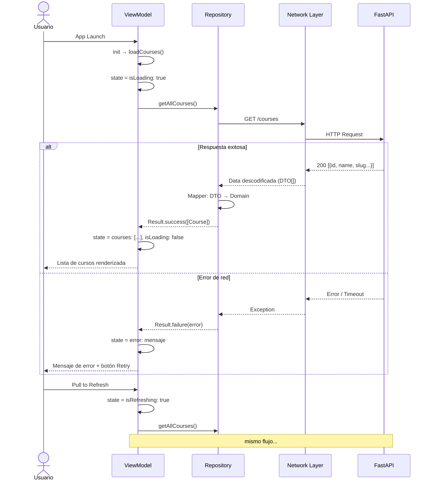

---

## 8. Flujo de Capas — Backend

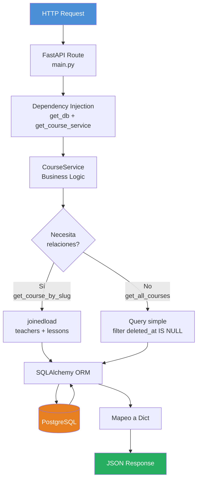

---

## 9. Arquitectura de Capas — Comparativa

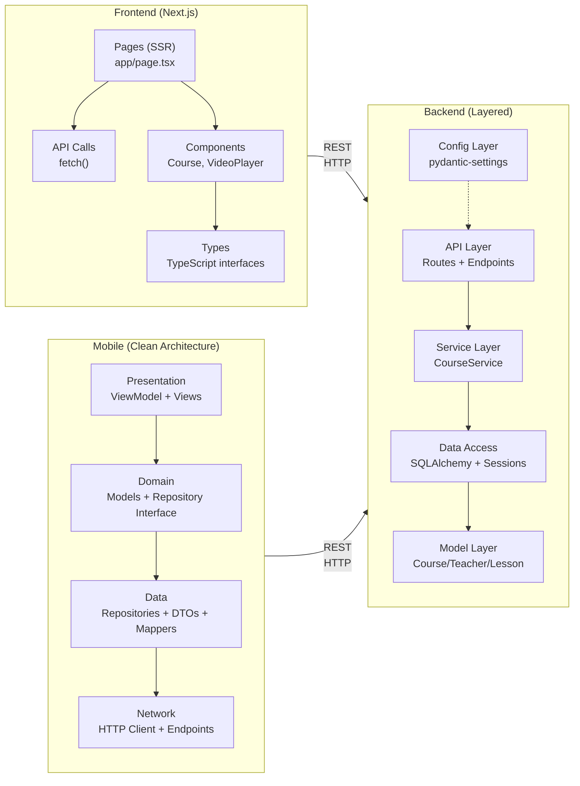

---

## 10. Modelo de Datos — Base de Datos

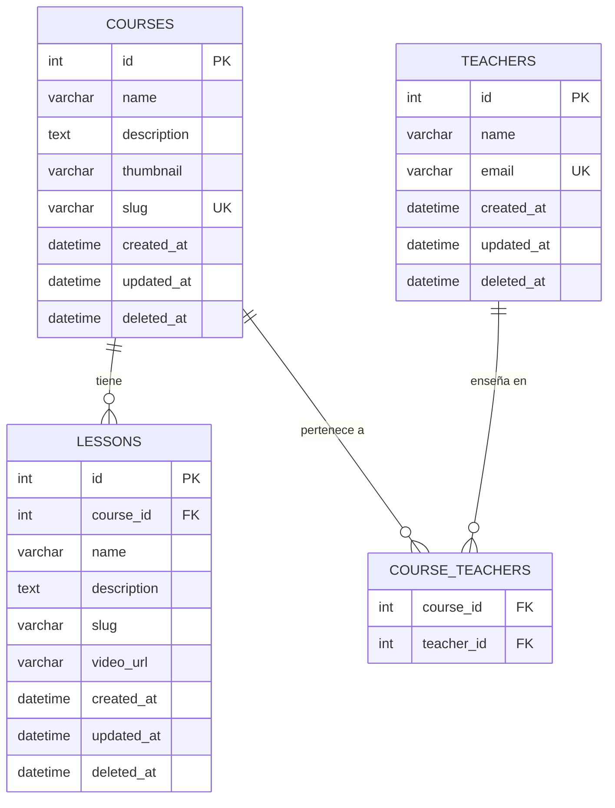

---

## 11. Infraestructura Docker

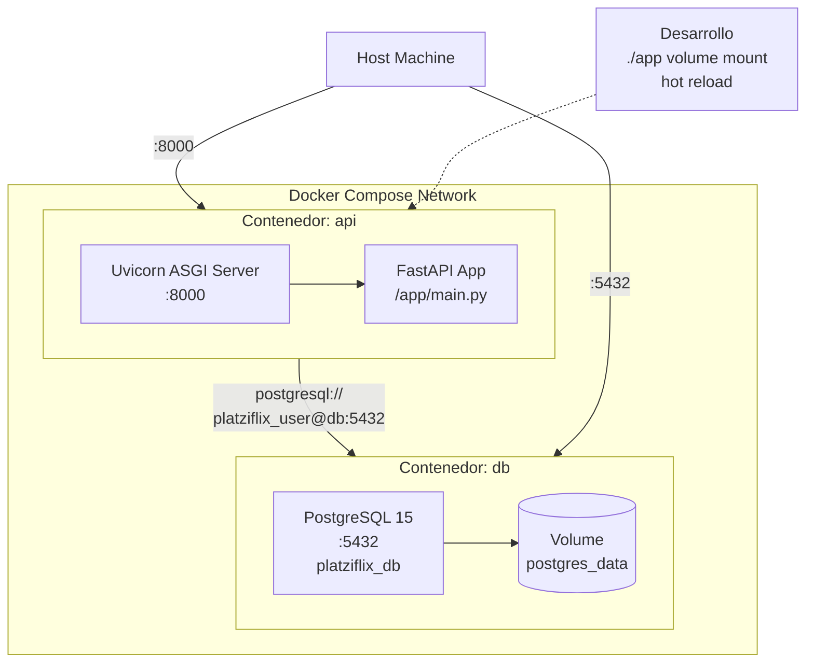

---

## 12. Resumen Técnico por Proyecto

### Backend
- **Framework:** FastAPI 0.104+ con Uvicorn (ASGI)
- **ORM:** SQLAlchemy 2.0+ con Alembic para migraciones
- **DB:** PostgreSQL 15
- **Patrón:** Layered Architecture + Soft Delete + Dependency Injection
- **Endpoints activos:** `GET /`, `GET /health`, `GET /courses`, `GET /courses/{slug}`
- **Infra:** Docker + Docker Compose, gestor `uv`

### Frontend
- **Framework:** Next.js 15.3 (App Router) + React 19 + TypeScript strict
- **Estilos:** SCSS Modules + sistema de tokens de color
- **Renderizado:** Server Components por defecto (SSR), `no-store` cache
- **Testing:** Vitest + React Testing Library
- **Estado:** Sin state management — data fetching en servidor
- **Features preparadas:** Progress, Quiz, Favorites (tipos definidos, no implementados)

### Mobile Android
- **Lenguaje/UI:** Kotlin + Jetpack Compose + Material 3
- **Patrón:** MVVM + MVI + Clean Architecture (3 capas: Data/Domain/Presentation)
- **Red:** Retrofit + OkHttp + Gson
- **Async:** Coroutines + StateFlow
- **DI:** Manual via AppModule

### Mobile iOS
- **Lenguaje/UI:** Swift + SwiftUI
- **Patrón:** MVVM + Clean Architecture (3 capas: Data/Domain/Presentation)
- **Red:** URLSession nativo + Codable + Async/Await
- **Reactivo:** @Published + @ObservableObject + Combine
- **DI:** Manual via constructor injection
- **Extra:** Accesibilidad (VoiceOver), Design System propio

---

## 13. API Contract — Endpoints Requeridos

| Método | Endpoint | Usado por | Respuesta |
|--------|----------|-----------|-----------|
| `GET` | `/courses` | Web, Android, iOS | `[{id, name, description, thumbnail, slug}]` |
| `GET` | `/courses/{slug}` | Web | `{...course, teacher_id[], classes[]}` |
| `GET` | `/classes/{id}` | Web | `{id, title, description, video, duration, slug}` |
| `GET` | `/health` | Monitoring | `{status, service, version, database, courses_count}` |

> **Nota:** Los proyectos Mobile solo consumen `GET /courses`. El frontend consume todos los endpoints.
