# PlatziFlixe — Arquitectura del Sistema

---

## Levantar el entorno local

### Requisitos previos
- [Docker Desktop](https://www.docker.com/products/docker-desktop/) instalado y corriendo
- Puerto `8000` (API) y `5432` (PostgreSQL) libres en tu máquina

### Primera vez (o entorno limpio)

```bash
# 1. Ir a la carpeta del backend
cd Backend

# 2. Construir imágenes y levantar contenedores en background
docker-compose up -d --build

# 3. Ejecutar migraciones de base de datos
docker-compose exec api bash -c "cd /app && uv run alembic -c app/alembic.ini upgrade head"

# 4. Cargar datos de ejemplo (3 cursos, 3 profesores, 6 lecciones)
docker-compose exec api bash -c "cd /app && uv run python -m app.db.seed"
```

### Uso cotidiano (ya construido)

```bash
cd Backend

docker-compose up -d        # Iniciar
docker-compose down         # Detener
docker-compose logs -f      # Ver logs en tiempo real
docker-compose restart      # Reiniciar
```

### Verificar que funciona

```bash
# Health check — debe responder {"status":"ok","database":true,"courses_count":3}
curl http://localhost:8000/health

# Lista de cursos
curl http://localhost:8000/courses

# Detalle de un curso
curl http://localhost:8000/courses/curso-de-react
```

También puedes abrir la documentación interactiva en el navegador:
- **Swagger UI:** `http://localhost:8000/docs`
- **ReDoc:** `http://localhost:8000/redoc`

### Reiniciar datos de ejemplo

```bash
# Limpiar datos y recargar desde cero
docker-compose exec api bash -c "cd /app && uv run python -m app.db.seed clear"
docker-compose exec api bash -c "cd /app && uv run python -m app.db.seed"
```

### Limpiar todo (contenedores + volúmenes + imágenes)

```bash
docker-compose down -v --rmi all --remove-orphans
```

### Credenciales de la base de datos

| Parámetro | Valor |
|-----------|-------|
| Host | `localhost:5432` |
| Base de datos | `platziflix_db` |
| Usuario | `platziflix_user` |
| Contraseña | `platziflix_password` |

---

## Resumen Ejecutivo

PlatziFlix es una plataforma de cursos online compuesta por **tres proyectos independientes** que comparten la misma API:

| Proyecto | Tecnología | Rol |
|----------|-----------|-----|
| **Backend** | Python + FastAPI + PostgreSQL | API REST + Lógica de negocio |
| **Frontend** | Next.js 15 + React 19 + TypeScript | Aplicación web SSR |
| **Mobile Android** | Kotlin + Jetpack Compose | App nativa Android (MVVM) |
| **Mobile iOS** | Swift + SwiftUI | App nativa iOS (MVVM) |

---

## 1. Diagrama de Arquitectura General (Big Picture)

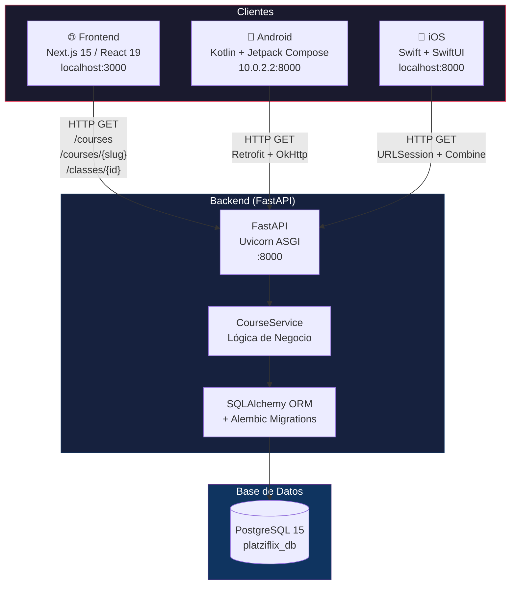

---

## 2. Diagrama de Clases — Backend (Modelos de Datos)

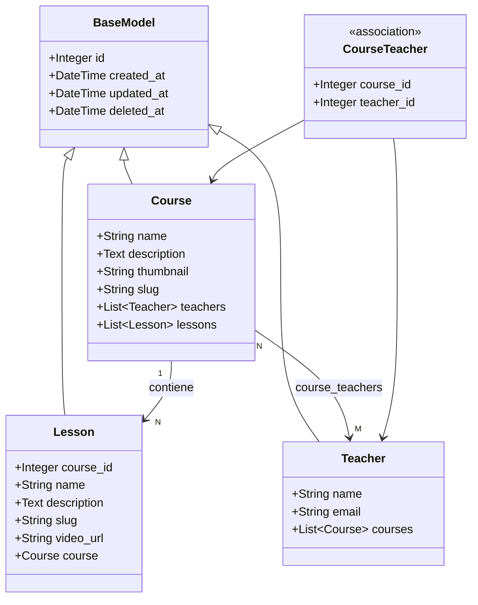

---

## 3. Diagrama de Clases — Frontend (TypeScript Types)

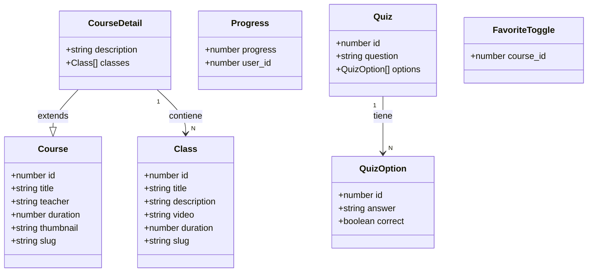

---

## 4. Diagrama de Clases — Mobile Android

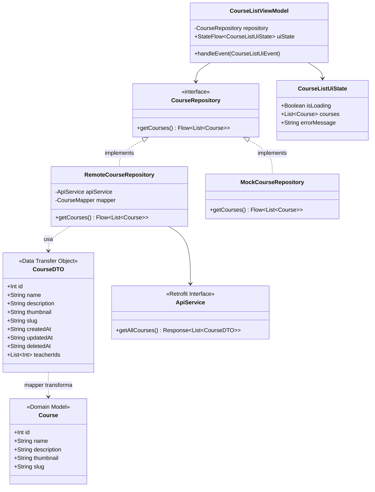

---

## 5. Diagrama de Clases — Mobile iOS

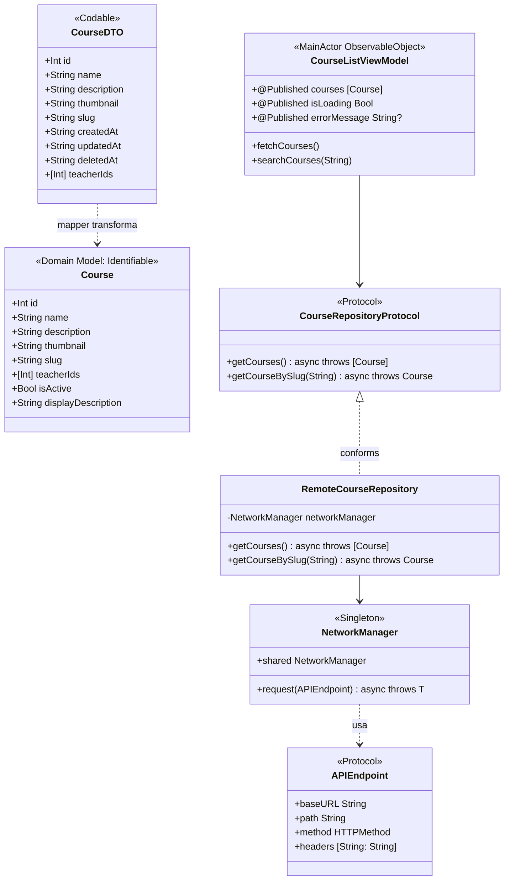

---

## 6. Flujo de Datos — Listado de Cursos

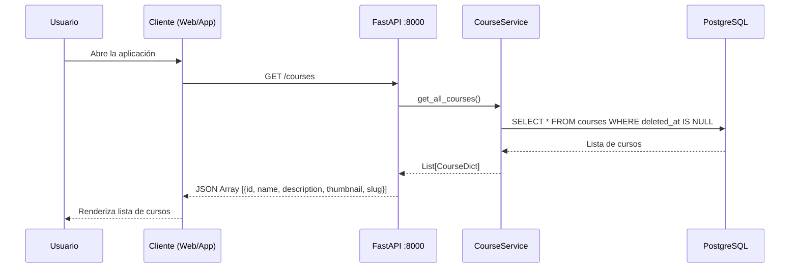

---

## 7. Flujo de Datos — Detalle de Curso

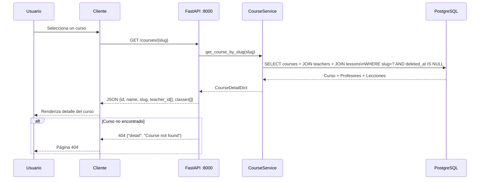

---

## 8. Flujo de la Aplicación Frontend (Next.js App Router)

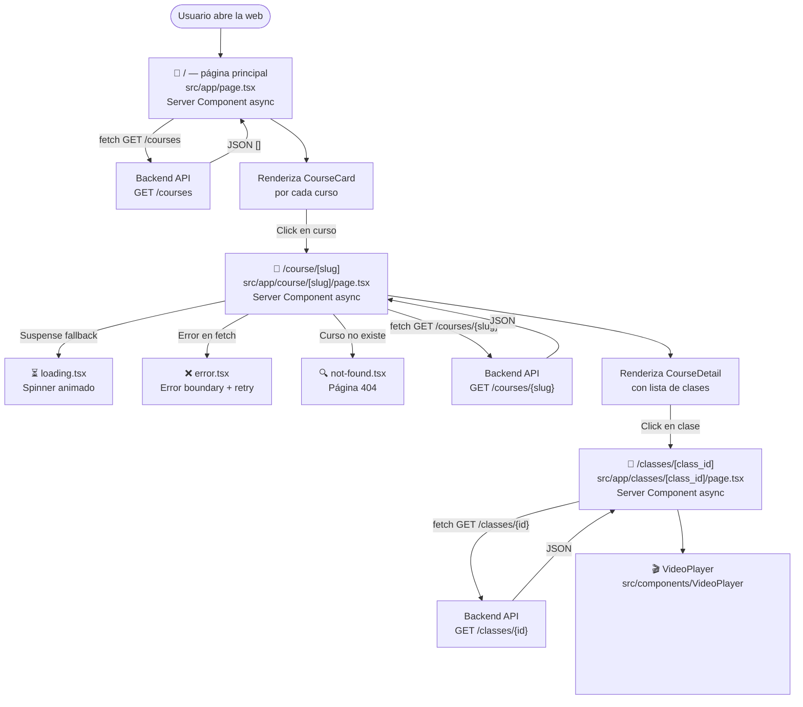

---

## 9. Flujo MVVM — Android (Jetpack Compose)

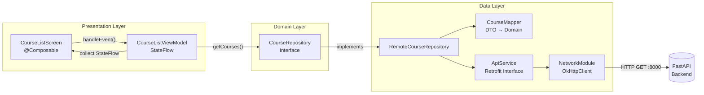

---

## 10. Flujo MVVM — iOS (SwiftUI)

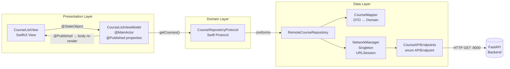

---

## 11. Diagrama de Base de Datos (ERD)

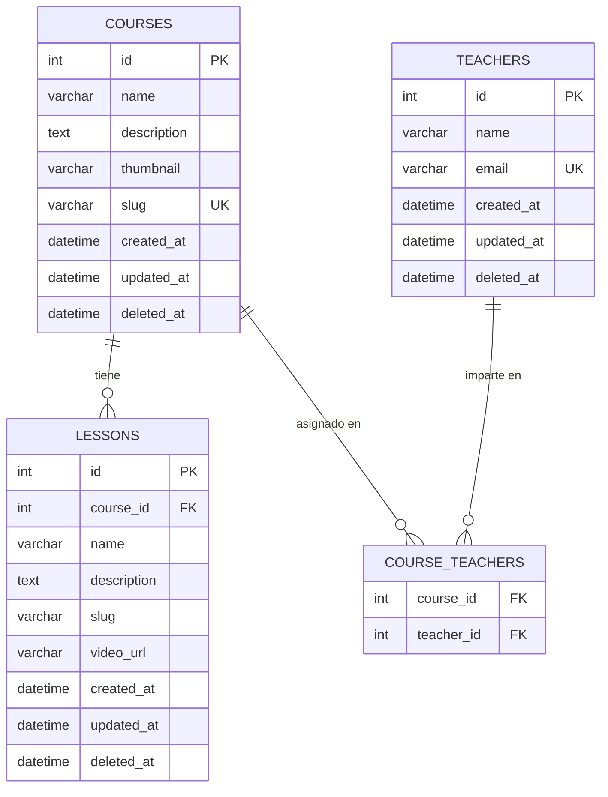

---

## 12. Comparativa de Stacks por Plataforma

| Aspecto | Backend | Frontend | Android | iOS |
|--------|---------|----------|---------|-----|
| **Lenguaje** | Python 3.11 | TypeScript 5 | Kotlin | Swift 5 |
| **Framework** | FastAPI 0.104 | Next.js 15.3 | Jetpack Compose | SwiftUI |
| **Patrón** | Service Layer | Server Components | MVVM + Clean | MVVM + Clean |
| **BD/Estado** | PostgreSQL 15 | SSR (sin estado) | StateFlow | @Published + Combine |
| **HTTP Client** | — | fetch nativo | Retrofit 2.9 | URLSession |
| **Serialización** | Pydantic | TypeScript types | Gson | Codable |
| **Imágenes** | — | next/image | Coil 2.5 | AsyncImage |
| **Testing** | pytest (10 tests) | Vitest + RTL | pendiente | pendiente |
| **Contenedor** | Docker + compose | — | — | — |
| **Auth** | ❌ No implementado | ❌ No implementado | ❌ No implementado | ❌ No implementado |

---

## 13. Puntos Destacados y Observaciones

### Fortalezas
- **Arquitectura Clean consistente** en móvil: ambas plataformas siguen MVVM + Data/Domain/Presentation
- **Backend minimalista y correcto**: 4 endpoints bien definidos, sin over-engineering
- **Mappers explícitos**: DTO → Domain en Android e iOS, evitan acoplar la API al dominio
- **Soft Delete** en todos los modelos del backend (campo `deleted_at`)
- **Server Components** en Next.js: rendimiento óptimo sin estado en cliente
- **Type safety end-to-end**: TypeScript en frontend, data classes en Kotlin, structs en Swift

### Gaps / Trabajo Pendiente
- **Autenticación**: ninguna capa la implementa aún
- **Endpoints faltantes**: Frontend/Mobile llaman a `/classes/{id}` pero el backend no lo expone
- **Sin caché local** en móvil (Room / CoreData)
- **Paginación**: la API devuelve todos los cursos sin paginación
- **Sin CRUD**: solo lectura (GET), no hay creación ni edición
- **Types sin uso** en Frontend: `Progress`, `Quiz`, `FavoriteToggle` — features futuras

### Convenciones de URL del Backend
| Cliente | Base URL configurada |
|---------|---------------------|
| Frontend | `http://localhost:8000` |
| Android (emulador) | `http://10.0.2.2:8000` |
| iOS | `http://localhost:8000` |
