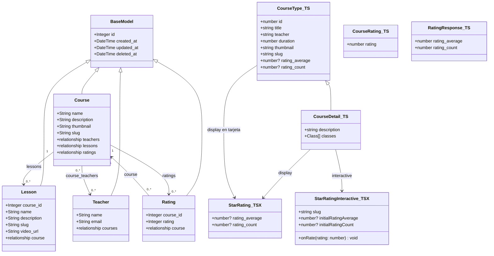
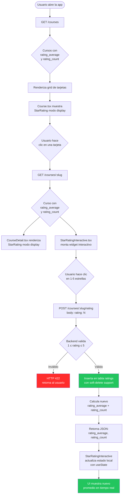
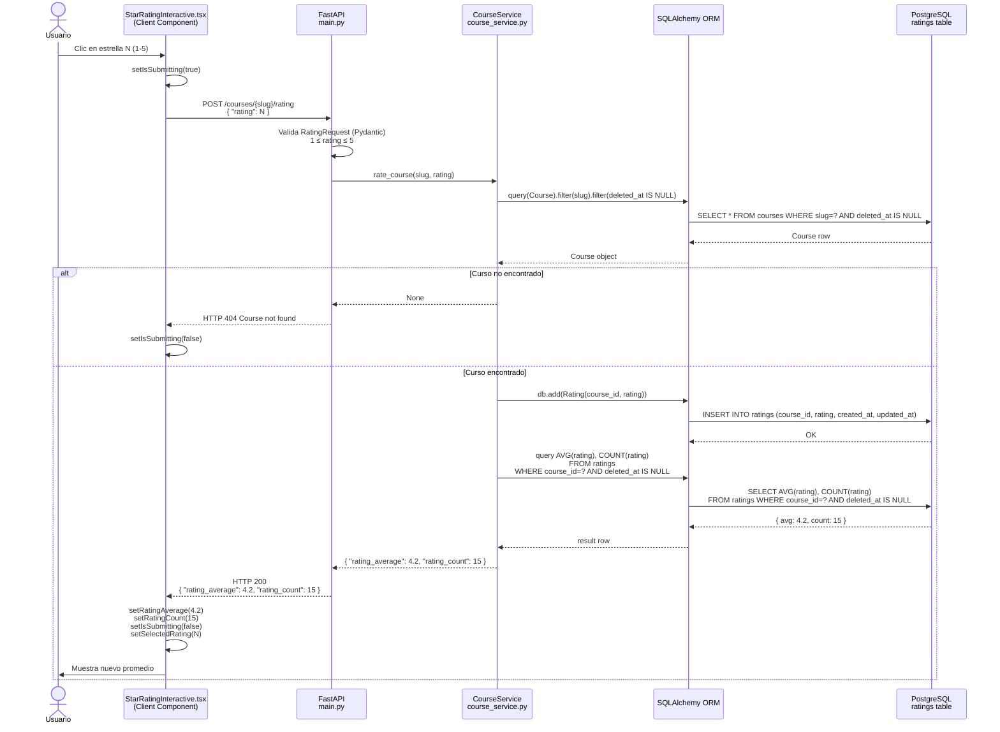

# 00 — Plan de Implementación: Sistema de Ratings

**Feature:** Rating de cursos (1 a 5 estrellas)
**Fecha:** 2026-04-10
**Basado en:** `analisis/00_sistema_de_ratings.md`
**Proyectos:** Backend, Frontend

---

## Resumen Ejecutivo

El sistema de ratings agrega la capacidad de que los usuarios califiquen cursos con 1 a 5 estrellas. La v1 es anónima (sin autenticación). La arquitectura extiende el patrón existente sin romper contratos: los endpoints `GET` existentes amplían su respuesta con dos campos nuevos opcionales (`rating_average`, `rating_count`), y se agrega un endpoint `POST /courses/{slug}/rating`. El widget interactivo se aísla en un Client Component dedicado para preservar el SSR del resto de la página de detalle.

**Orden de dependencias crítico:**
1. Base de datos (modelo + migración) — todo lo demás depende de esto
2. Servicio — depende del modelo
3. Endpoint — depende del servicio
4. Tipos Frontend — pueden hacerse en paralelo con Backend
5. Componentes Frontend — dependen de los tipos
6. Integración en páginas — depende de los componentes

---

## 1. Diagrama de Clases



---

## 2. Diagrama de Flujo



---

## 3. Diagrama de Secuencia — POST /courses/{slug}/rating



---

## 4. Plan de Implementación Paso a Paso

### Paso 1 — Crear el modelo `Rating` (Backend)

**Archivo:** `Backend/app/models/rating.py` (CREAR)

```python
from sqlalchemy import Column, Integer, ForeignKey, CheckConstraint
from sqlalchemy.orm import relationship
from .base import BaseModel


class Rating(BaseModel):
    """
    Rating model representing anonymous course ratings (1-5 stars).
    v1: anonymous ratings, no user tracking.
    """
    __tablename__ = 'ratings'

    course_id = Column(Integer, ForeignKey('courses.id'), nullable=False, index=True)
    rating = Column(Integer, nullable=False)

    __table_args__ = (
        CheckConstraint('rating >= 1 AND rating <= 5', name='rating_value_check'),
    )

    course = relationship("Course", back_populates="ratings")

    def __repr__(self):
        return f"<Rating(id={self.id}, course_id={self.course_id}, rating={self.rating})>"
```

**Notas:**
- `CheckConstraint` en BD como segunda línea de defensa (la primera es Pydantic en FastAPI).
- `deleted_at` heredado de `BaseModel` — soft delete disponible aunque no se usa activamente en v1.
- Sin `user_id` — anónimo por decisión de diseño de v1.

---

### Paso 2 — Registrar `Rating` en `__init__.py` (Backend)

**Archivo:** `Backend/app/models/__init__.py` (MODIFICAR)

```python
from .rating import Rating

__all__ = [
    'BaseModel',
    'Base',
    'Teacher',
    'Course',
    'Lesson',
    'course_teachers',
    'Rating',        # nuevo
]
```

**Por qué es necesario:** Alembic detecta modelos a través de este `__init__.py`. Sin este registro la migración autogenerada no incluirá la tabla `ratings`.

---

### Paso 3 — Agregar `relationship` en `Course` (Backend)

**Archivo:** `Backend/app/models/course.py` (MODIFICAR)

Agregar después de la relación con `lessons`:

```python
# One-to-many relationship with Rating
ratings = relationship(
    "Rating",
    back_populates="course",
    cascade="all, delete-orphan"
)
```

---

### Paso 4 — Crear la migración Alembic (Backend)

**Archivo:** `Backend/app/alembic/versions/[hash]_add_ratings_table.py` (CREAR)

```bash
make create-migration  # mensaje: "add_ratings_table"
```

Contenido esperado en `upgrade()` / `downgrade()`:

```python
"""Add ratings table

Revision ID: [generado por alembic]
Revises: d18a08253457
Create Date: [fecha]
"""
from typing import Sequence, Union
from alembic import op
import sqlalchemy as sa

revision: str = '[generado por alembic]'
down_revision: Union[str, None] = 'd18a08253457'
branch_labels: Union[str, Sequence[str], None] = None
depends_on: Union[str, Sequence[str], None] = None


def upgrade() -> None:
    op.create_table(
        'ratings',
        sa.Column('id', sa.Integer(), nullable=False),
        sa.Column('course_id', sa.Integer(), nullable=False),
        sa.Column('rating', sa.Integer(), nullable=False),
        sa.Column('created_at', sa.DateTime(), nullable=False),
        sa.Column('updated_at', sa.DateTime(), nullable=False),
        sa.Column('deleted_at', sa.DateTime(), nullable=True),
        sa.CheckConstraint('rating >= 1 AND rating <= 5', name='rating_value_check'),
        sa.ForeignKeyConstraint(['course_id'], ['courses.id']),
        sa.PrimaryKeyConstraint('id')
    )
    op.create_index(op.f('ix_ratings_id'), 'ratings', ['id'], unique=False)
    op.create_index(op.f('ix_ratings_course_id'), 'ratings', ['course_id'], unique=False)


def downgrade() -> None:
    op.drop_index(op.f('ix_ratings_course_id'), table_name='ratings')
    op.drop_index(op.f('ix_ratings_id'), table_name='ratings')
    op.drop_table('ratings')
```

Después de crear el archivo: `make migrate`

**Por qué el índice en `course_id`:** Cada consulta de promedio filtra por `course_id`. Sin índice sería un full scan de `ratings` por cada curso del listado.

---

### Paso 5 — Actualizar `CourseService` (Backend)

**Archivo:** `Backend/app/services/course_service.py` (MODIFICAR — reemplazar completo)

```python
from typing import List, Optional, Dict, Any
from sqlalchemy import func
from sqlalchemy.orm import Session, joinedload
from app.models.course import Course
from app.models.rating import Rating


class CourseService:
    def __init__(self, db: Session):
        self.db = db

    def _get_rating_stats(self, course_id: int) -> Dict[str, Any]:
        """
        Calcula rating_average y rating_count para un curso.
        Solo considera ratings con deleted_at IS NULL.
        Retorna None en rating_average si no hay ratings aún.
        """
        result = (
            self.db.query(
                func.avg(Rating.rating).label("rating_average"),
                func.count(Rating.id).label("rating_count"),
            )
            .filter(Rating.course_id == course_id)
            .filter(Rating.deleted_at.is_(None))
            .first()
        )
        avg = float(round(result.rating_average, 1)) if result.rating_average is not None else None
        return {
            "rating_average": avg,
            "rating_count": result.rating_count or 0,
        }

    def get_all_courses(self) -> List[Dict[str, Any]]:
        courses = (
            self.db.query(Course)
            .filter(Course.deleted_at.is_(None))
            .all()
        )
        result = []
        for c in courses:
            stats = self._get_rating_stats(c.id)
            result.append({
                "id": c.id,
                "name": c.name,
                "description": c.description,
                "thumbnail": c.thumbnail,
                "slug": c.slug,
                "rating_average": stats["rating_average"],
                "rating_count": stats["rating_count"],
            })
        return result

    def get_course_by_slug(self, slug: str) -> Optional[Dict[str, Any]]:
        course = (
            self.db.query(Course)
            .options(joinedload(Course.teachers), joinedload(Course.lessons))
            .filter(Course.slug == slug)
            .filter(Course.deleted_at.is_(None))
            .first()
        )
        if not course:
            return None
        stats = self._get_rating_stats(course.id)
        return {
            "id": course.id,
            "name": course.name,
            "description": course.description,
            "thumbnail": course.thumbnail,
            "slug": course.slug,
            "teacher_id": [t.id for t in course.teachers],
            "classes": [
                {
                    "id": l.id,
                    "name": l.name,
                    "description": l.description,
                    "slug": l.slug,
                }
                for l in course.lessons
                if l.deleted_at is None
            ],
            "rating_average": stats["rating_average"],
            "rating_count": stats["rating_count"],
        }

    def rate_course(self, slug: str, rating: int) -> Optional[Dict[str, Any]]:
        """
        Inserta un rating anónimo para el curso identificado por slug.
        Retorna el nuevo promedio y conteo, o None si el curso no existe.
        """
        course = (
            self.db.query(Course)
            .filter(Course.slug == slug)
            .filter(Course.deleted_at.is_(None))
            .first()
        )
        if not course:
            return None

        new_rating = Rating(course_id=course.id, rating=rating)
        self.db.add(new_rating)
        self.db.commit()

        return self._get_rating_stats(course.id)
```

**Nota sobre N+1 en `get_all_courses`:** Con pocos cursos la consulta extra por curso es imperceptible. Si el catálogo crece se puede optimizar con `GROUP BY` en un paso posterior sin cambiar la firma del método.

---

### Paso 6 — Agregar endpoint en `main.py` (Backend)

**Archivo:** `Backend/app/main.py` (MODIFICAR)

```python
from fastapi import FastAPI, HTTPException, Depends
from pydantic import BaseModel as PydanticBaseModel, Field
from sqlalchemy import text
from sqlalchemy.orm import Session
from app.core.config import settings
from app.db.base import engine, get_db
from app.services.course_service import CourseService

app = FastAPI(title=settings.project_name, version=settings.version)


def get_course_service(db: Session = Depends(get_db)) -> CourseService:
    return CourseService(db)


class RatingRequest(PydanticBaseModel):
    rating: int = Field(..., ge=1, le=5, description="Rating value between 1 and 5")


@app.get("/courses")
def get_courses(course_service: CourseService = Depends(get_course_service)) -> list:
    return course_service.get_all_courses()


@app.get("/courses/{slug}")
def get_course_by_slug(
    slug: str,
    course_service: CourseService = Depends(get_course_service),
) -> dict:
    course = course_service.get_course_by_slug(slug)
    if not course:
        raise HTTPException(status_code=404, detail="Course not found")
    return course


@app.post("/courses/{slug}/rating")
def rate_course(
    slug: str,
    body: RatingRequest,
    course_service: CourseService = Depends(get_course_service),
) -> dict:
    result = course_service.rate_course(slug, body.rating)
    if result is None:
        raise HTTPException(status_code=404, detail="Course not found")
    return result
```

**Por qué `Field(ge=1, le=5)`:** Pydantic valida el rango antes de que el request llegue al servicio. Si el valor está fuera de rango, FastAPI retorna HTTP 422 automáticamente — sin código adicional.

---

### Paso 7 — Actualizar el contrato (Backend)

**Archivo:** `Backend/specs/00_contracts.md` (MODIFICAR — agregar sección)

````markdown
## Actualización v2 — Sistema de Ratings

### Campos nuevos en `Course`

Los endpoints `GET /courses` y `GET /courses/{slug}` ahora incluyen:

```json
{
  "rating_average": 4.2,
  "rating_count": 15
}
```

- `rating_average`: `Float | null` — promedio redondeado a 1 decimal. `null` si el curso no tiene ratings.
- `rating_count`: `Integer` — cantidad total de ratings activos (excluye soft-deleted).

### Nuevo endpoint: POST /courses/{slug}/rating

**Request:**
```json
{ "rating": 4 }
```
- `rating`: `Integer` — obligatorio, rango cerrado [1, 5]. HTTP 422 si está fuera de rango.

**Response 200:**
```json
{ "rating_average": 4.2, "rating_count": 15 }
```

**Response 404:**
```json
{ "detail": "Course not found" }
```
````

---

### Paso 8 — Actualizar tipos TypeScript (Frontend)

**Archivo:** `Frontend/src/types/index.ts` (MODIFICAR)

```typescript
export interface Course {
  id: number;
  title: string;
  teacher: string;
  duration: number;
  thumbnail: string;
  slug: string;
  rating_average?: number | null;
  rating_count?: number;
}

export interface Class {
  id: number;
  title: string;
  description: string;
  video: string;
  duration: number;
  slug: string;
}

export interface CourseDetail extends Course {
  description: string;
  classes: Class[];
}

export interface CourseRating {
  rating: number; // 1–5
}

export interface RatingResponse {
  rating_average: number;
  rating_count: number;
}

export interface Progress {
  progress: number; // seconds
  user_id: number;
}

export interface QuizOption {
  id: number;
  answer: string;
  correct: boolean;
}

export interface Quiz {
  id: number;
  question: string;
  options: QuizOption[];
}

export interface FavoriteToggle {
  course_id: number;
}
```

**Por qué `rating_average?: number | null`:** El `?` cubre respuestas sin el campo (caché o datos legacy). La unión con `null` cubre el caso explícito que retorna el backend cuando el curso no tiene ratings.

---

### Paso 9 — Crear `StarRating` y `StarRatingInteractive` (Frontend)

**Archivo:** `Frontend/src/components/StarRating/StarRating.tsx` (CREAR — Server Component)

```tsx
import styles from "./StarRating.module.scss";

interface StarRatingProps {
  rating_average?: number | null;
  rating_count?: number;
}

export const StarRating = ({ rating_average, rating_count = 0 }: StarRatingProps) => {
  if (rating_average == null || rating_count === 0) {
    return (
      <div className={styles.ratingContainer}>
        <span className={styles.noRating}>Sin calificaciones aún</span>
      </div>
    );
  }

  const fullStars = Math.floor(rating_average);
  const hasHalfStar = rating_average - fullStars >= 0.5;

  return (
    <div className={styles.ratingContainer}>
      <div className={styles.stars} aria-label={`${rating_average} de 5 estrellas`}>
        {[1, 2, 3, 4, 5].map((star) => (
          <span
            key={star}
            className={
              star <= fullStars
                ? styles.starFull
                : star === fullStars + 1 && hasHalfStar
                ? styles.starHalf
                : styles.starEmpty
            }
          >
            ★
          </span>
        ))}
      </div>
      <span className={styles.ratingText}>
        {rating_average.toFixed(1)} ({rating_count} {rating_count === 1 ? "calificación" : "calificaciones"})
      </span>
    </div>
  );
};
```

**Archivo:** `Frontend/src/components/StarRating/StarRatingInteractive.tsx` (CREAR — Client Component)

```tsx
"use client";

import { useState } from "react";
import { RatingResponse } from "@/types";
import styles from "./StarRating.module.scss";

interface StarRatingInteractiveProps {
  slug: string;
  initialRatingAverage?: number | null;
  initialRatingCount?: number;
}

export const StarRatingInteractive = ({
  slug,
  initialRatingAverage,
  initialRatingCount = 0,
}: StarRatingInteractiveProps) => {
  const [ratingAverage, setRatingAverage] = useState<number | null>(
    initialRatingAverage ?? null
  );
  const [ratingCount, setRatingCount] = useState(initialRatingCount);
  const [hoveredStar, setHoveredStar] = useState<number | null>(null);
  const [selectedRating, setSelectedRating] = useState<number | null>(null);
  const [isSubmitting, setIsSubmitting] = useState(false);
  const [error, setError] = useState<string | null>(null);

  const handleRate = async (rating: number) => {
    if (isSubmitting) return;
    setIsSubmitting(true);
    setError(null);

    try {
      const res = await fetch(`http://localhost:8000/courses/${slug}/rating`, {
        method: "POST",
        headers: { "Content-Type": "application/json" },
        body: JSON.stringify({ rating }),
      });

      if (!res.ok) throw new Error("Error al enviar calificación");

      const data: RatingResponse = await res.json();
      setRatingAverage(data.rating_average);
      setRatingCount(data.rating_count);
      setSelectedRating(rating);
    } catch {
      setError("No se pudo guardar tu calificación. Intenta de nuevo.");
    } finally {
      setIsSubmitting(false);
    }
  };

  const displayStar = hoveredStar ?? selectedRating ?? 0;

  return (
    <div className={styles.interactiveContainer}>
      <p className={styles.interactiveLabel}>
        {selectedRating ? "Tu calificación:" : "Califica este curso:"}
      </p>
      <div className={styles.interactiveStars}>
        {[1, 2, 3, 4, 5].map((star) => (
          <button
            key={star}
            className={`${styles.starButton} ${star <= displayStar ? styles.starButtonActive : ""}`}
            onClick={() => handleRate(star)}
            onMouseEnter={() => setHoveredStar(star)}
            onMouseLeave={() => setHoveredStar(null)}
            disabled={isSubmitting}
            aria-label={`Calificar con ${star} estrella${star !== 1 ? "s" : ""}`}
          >
            ★
          </button>
        ))}
      </div>
      {isSubmitting && <span className={styles.submitting}>Guardando...</span>}
      {error && <span className={styles.errorText}>{error}</span>}
      {ratingAverage != null && ratingCount > 0 && (
        <span className={styles.ratingText}>
          Promedio: {ratingAverage.toFixed(1)} ({ratingCount}{" "}
          {ratingCount === 1 ? "calificación" : "calificaciones"})
        </span>
      )}
    </div>
  );
};
```

**Archivo:** `Frontend/src/components/StarRating/StarRating.module.scss` (CREAR)

```scss
// --- Modo display (StarRating) ---

.ratingContainer {
  display: flex;
  align-items: center;
  gap: 0.5rem;
  flex-wrap: wrap;
}

.stars {
  display: flex;
  gap: 2px;
}

.starFull {
  color: color('primary');
  font-size: 1.2rem;
  line-height: 1;
}

.starHalf {
  color: color('primary');
  font-size: 1.2rem;
  line-height: 1;
  opacity: 0.6;
}

.starEmpty {
  color: color('light-gray');
  font-size: 1.2rem;
  line-height: 1;
}

.ratingText {
  color: color('text-secondary');
  font-size: 0.9rem;
  font-weight: 500;
}

.noRating {
  color: color('text-secondary');
  font-size: 0.85rem;
  font-weight: 400;
  opacity: 0.6;
}

// --- Modo interactivo (StarRatingInteractive) ---

.interactiveContainer {
  display: flex;
  flex-direction: column;
  gap: 0.75rem;
  padding: 1rem;
  background: color('off-white');
  border-radius: 12px;
  border: 1px solid color('light-gray');
}

.interactiveLabel {
  font-size: 0.95rem;
  font-weight: 600;
  color: color('text-primary');
  margin: 0;
}

.interactiveStars {
  display: flex;
  gap: 4px;
}

.starButton {
  background: none;
  border: none;
  cursor: pointer;
  font-size: 2rem;
  color: color('light-gray');
  padding: 0 2px;
  transition: color 0.15s, transform 0.1s;
  line-height: 1;

  &:hover:not(:disabled) {
    transform: scale(1.2);
  }

  &:disabled {
    cursor: not-allowed;
    opacity: 0.5;
  }
}

.starButtonActive {
  color: color('primary');
}

.submitting {
  font-size: 0.85rem;
  color: color('text-secondary');
  font-style: italic;
}

.errorText {
  font-size: 0.85rem;
  color: color('primary');
  font-weight: 500;
}
```

**Por qué archivos separados para `StarRating` y `StarRatingInteractive`:** `StarRating.tsx` no tiene `"use client"` y puede importarse desde cualquier Server Component sin introducir un boundary de cliente. Si estuvieran en el mismo archivo con `"use client"` al inicio, `StarRating` también se convertiría en Client Component innecesariamente.

---

### Paso 10 — Modificar `Course.tsx` (Frontend)

**Archivo:** `Frontend/src/components/Course/Course.tsx` (MODIFICAR)

```tsx
import styles from "./Course.module.scss";
import { Course as CourseType } from "@/types";
import { StarRating } from "@/components/StarRating/StarRating";

type CourseProps = Omit<CourseType, "slug">;

export const Course = ({
  id,
  title,
  teacher,
  duration,
  thumbnail,
  rating_average,
  rating_count,
}: CourseProps) => {
  return (
    <article className={styles.courseCard}>
      <div className={styles.thumbnailContainer}>
        
      </div>
      <div className={styles.courseInfo}>
        <h2 className={styles.courseTitle}>{title}</h2>
        <p className={styles.teacher}>Profesor: {teacher}</p>
        <p className={styles.duration}>Duración: {duration} minutos</p>
        <StarRating rating_average={rating_average} rating_count={rating_count} />
      </div>
    </article>
  );
};
```

`Course.tsx` permanece Server Component — `StarRating` tampoco tiene `"use client"`. No hay cambio de arquitectura SSR.

---

### Paso 11 — Modificar `CourseDetail.tsx` (Frontend)

**Archivo:** `Frontend/src/components/CourseDetail/CourseDetail.tsx` (MODIFICAR)

```tsx
import { FC } from "react";
import Link from "next/link";
import { CourseDetail } from "@/types";
import styles from "./CourseDetail.module.scss";
import { StarRating } from "@/components/StarRating/StarRating";
import { StarRatingInteractive } from "@/components/StarRating/StarRatingInteractive";

interface CourseDetailComponentProps {
  course: CourseDetail;
}

export const CourseDetailComponent: FC<CourseDetailComponentProps> = ({ course }) => {
  const formatDuration = (duration: number) => {
    const hours = Math.floor(duration / 3600);
    const minutes = Math.floor((duration % 3600) / 60);
    return `${hours}h ${minutes}m`;
  };

  const totalDuration = course.classes.reduce((acc, cls) => acc + cls.duration, 0);

  return (
    <div className={styles.container}>
      <div className={styles.navigation}>
        <Link href="/" className={styles.backButton}>← Volver a cursos</Link>
      </div>
      <div className={styles.header}>
        <div className={styles.thumbnailContainer}>
          
        </div>
        <div className={styles.courseInfo}>
          <h1 className={styles.title}>{course.title}</h1>
          <p className={styles.teacher}>Por {course.teacher}</p>
          <p className={styles.description}>{course.description}</p>
          <div className={styles.stats}>
            <span className={styles.duration}>Duración total: {formatDuration(totalDuration)}</span>
            <span className={styles.classCount}>{course.classes.length} clases</span>
            <StarRating
              rating_average={course.rating_average}
              rating_count={course.rating_count}
            />
          </div>
          <StarRatingInteractive
            slug={course.slug}
            initialRatingAverage={course.rating_average}
            initialRatingCount={course.rating_count}
          />
        </div>
      </div>
      <div className={styles.classesSection}>
        <h2 className={styles.sectionTitle}>Contenido del curso</h2>
        <div className={styles.classesList}>
          {course.classes.map((cls, index) => (
            <Link href={`/classes/${cls.id}`} key={cls.id} className={styles.classItem}>
              <div className={styles.classNumber}>{(index + 1).toString().padStart(2, "0")}</div>
              <div className={styles.classInfo}>
                <h3 className={styles.classTitle}>{cls.title}</h3>
                <p className={styles.classDescription}>{cls.description}</p>
                <span className={styles.classDuration}>{formatDuration(cls.duration)}</span>
              </div>
            </Link>
          ))}
        </div>
      </div>
    </div>
  );
};
```

**Por qué `StarRatingInteractive` no contamina el Server Component:** Next.js permite importar Client Components desde Server Components. El boundary `"use client"` solo aplica al subárbol de `StarRatingInteractive`, no al componente padre `CourseDetailComponent`.

---

### Paso 12 — Modificar `page.tsx` (Frontend)

**Archivo:** `Frontend/src/app/page.tsx` (MODIFICAR)

```tsx
import styles from "./page.module.scss";
import { Course } from "@/types";
import { Course as CourseComponent } from "@/components/Course/Course";
import Link from "next/link";

async function getCourses(): Promise<Course[]> {
  const res = await fetch("http://localhost:8000/courses", { cache: "no-store" });
  if (!res.ok) {
    throw new Error("Failed to fetch courses");
  }
  return res.json(); // FIX: era data.data — la API retorna el array directamente
}

export default async function Home() {
  const courses = await getCourses();

  return (
    <div className={styles.page}>
      <header className={styles.banner}>
        <span className={styles.bannerRed}>PLATZI</span>
        <span className={styles.bannerBlack}>FLIX</span>
        <span className={styles.bannerSub}>CURSOS</span>
      </header>
      <div className={styles.verticalLeft}>PLATZI</div>
      <div className={styles.verticalRight}>FLIX</div>
      <main className={styles.main}>
        <div className={styles.coursesGrid}>
          {courses.map((course) => (
            <Link href={`/course/${course.slug}`} key={course.id}>
              <CourseComponent
                id={course.id}
                title={course.title}
                teacher={course.teacher}
                duration={course.duration}
                thumbnail={course.thumbnail}
                rating_average={course.rating_average}
                rating_count={course.rating_count}
              />
            </Link>
          ))}
        </div>
      </main>
      <div className={styles.gridBg}></div>
    </div>
  );
}
```

---

## 5. Tabla de Dependencias y Orden de Ejecución

| Orden | Acción | Archivo | Bloquea a |
|-------|--------|---------|-----------|
| 1 | CREAR | `Backend/app/models/rating.py` | Pasos 2, 3, 4, 5 |
| 2 | MODIFICAR | `Backend/app/models/__init__.py` | Paso 4 (detección Alembic) |
| 3 | MODIFICAR | `Backend/app/models/course.py` | Paso 5 |
| 4 | CREAR | `Backend/app/alembic/versions/[hash]_add_ratings_table.py` | Paso 5 (BD debe existir) |
| 5 | MODIFICAR | `Backend/app/services/course_service.py` | Paso 6 |
| 6 | MODIFICAR | `Backend/app/main.py` | Paso 12 (Frontend consume el endpoint) |
| 7 | MODIFICAR | `Backend/specs/00_contracts.md` | Referencia — no bloquea |
| 8 | MODIFICAR | `Frontend/src/types/index.ts` | Pasos 9, 10, 11, 12 |
| 9 | CREAR | `Frontend/src/components/StarRating/StarRating.tsx` | Pasos 10, 11 |
| 9 | CREAR | `Frontend/src/components/StarRating/StarRatingInteractive.tsx` | Paso 11 |
| 9 | CREAR | `Frontend/src/components/StarRating/StarRating.module.scss` | Paso 9 |
| 10 | MODIFICAR | `Frontend/src/components/Course/Course.tsx` | Paso 12 |
| 11 | MODIFICAR | `Frontend/src/components/CourseDetail/CourseDetail.tsx` | — |
| 12 | MODIFICAR | `Frontend/src/app/page.tsx` | — |

---

## 6. Decisiones de Diseño

| Decisión | Alternativa descartada | Razón |
|----------|----------------------|-------|
| Ratings anónimos en v1 | Requerir autenticación | No existe sistema de usuarios; la deduplicación es un cambio aditivo posterior |
| Widget interactivo solo en detalle | También en tarjeta de lista | Evita convertir el grid en árbol de Client Components |
| `StarRating` y `StarRatingInteractive` en archivos separados | Un solo archivo con `"use client"` | Preserva SSR en `StarRating`; el boundary `"use client"` solo aplica al archivo que lo declara |
| `_get_rating_stats` como método privado | Duplicar AVG/COUNT en cada método | DRY; punto único de cambio si se optimiza la query |
| Redondeo a 1 decimal en Python | Redondear en Frontend | Consistencia garantizada independiente del cliente |
| `CheckConstraint` en BD + `Field(ge=1, le=5)` en Pydantic | Solo uno de los dos | Doble validación: Pydantic es la primera línea; la constraint en BD protege de inserciones directas |
