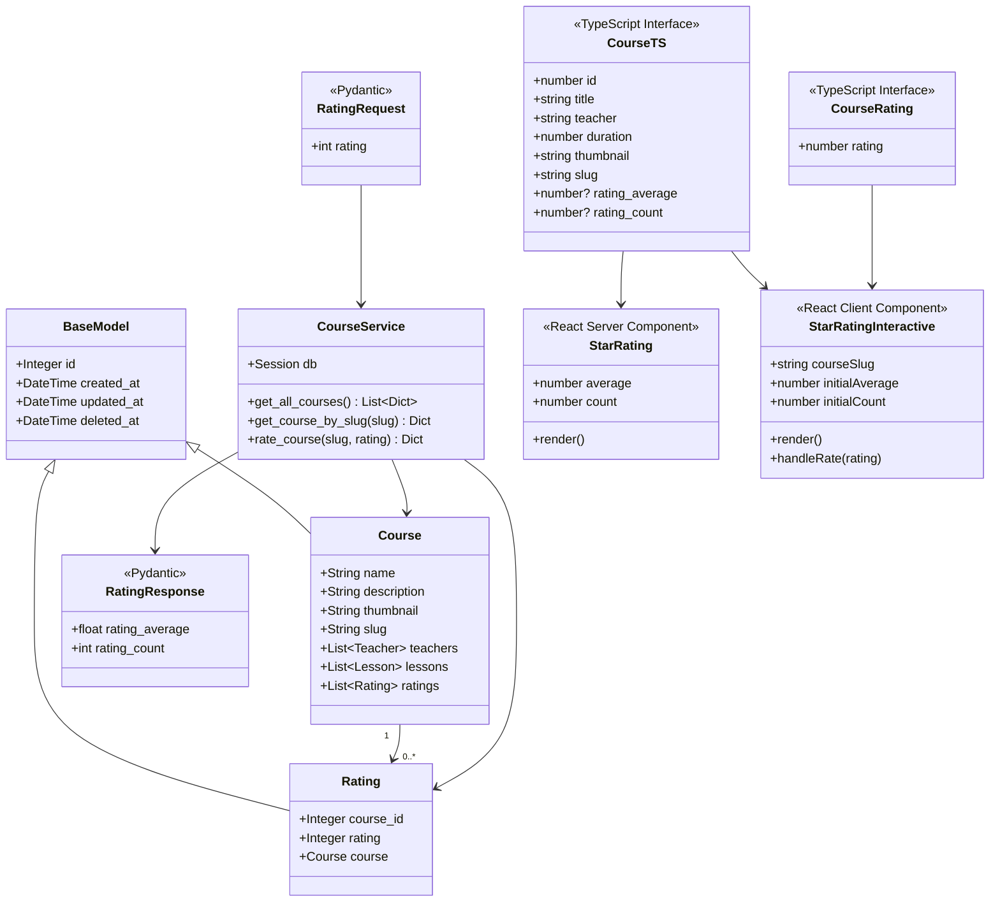
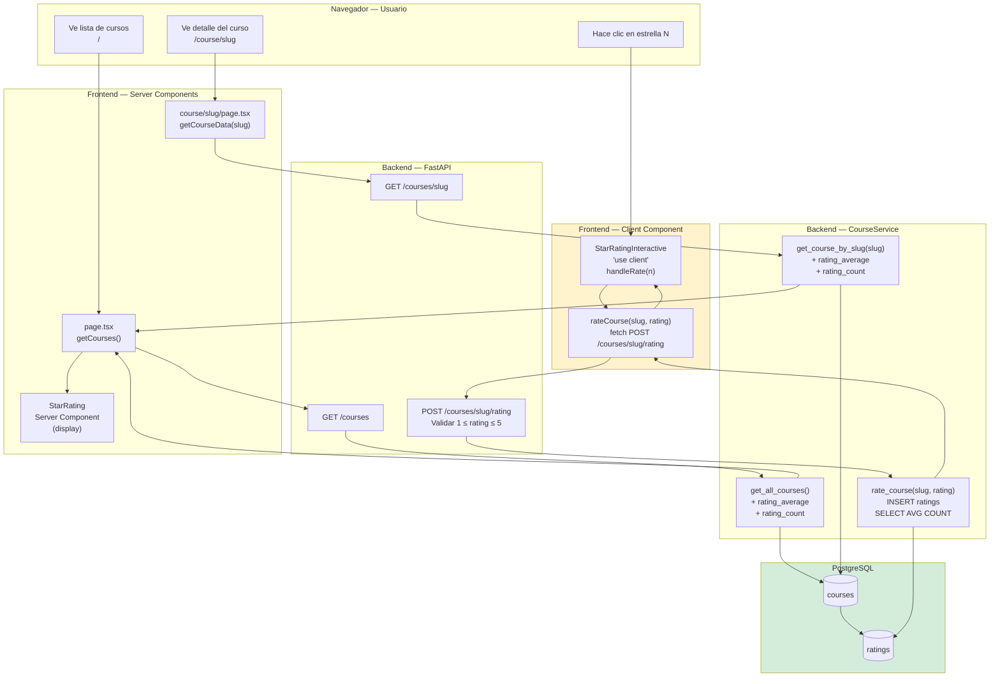

# Plan de Implementación: Sistema de Rating de Cursos

**Feature:** Rating de cursos — valoración de 1 a 5 estrellas
**Fecha:** 2026-04-30
**Proyectos afectados:** Backend (FastAPI + PostgreSQL), Frontend (Next.js 15)
**Proyectos excluidos:** Mobile Android, Mobile iOS
**Basado en:** `analisis/00_sistema_de_ratings.md`
**Autor del análisis:** Agent Architect — Platziflix

---

## 1. Resumen Ejecutivo

El sistema de rating permite a los usuarios valorar un curso con 1 a 5 estrellas. El backend almacena cada voto individual y calcula el promedio en tiempo real. El frontend lo muestra en modo lectura en la lista de cursos y en modo interactivo en el detalle del curso.

### Orden de dependencias crítico

El orden de implementación **no es intercambiable**. Cada paso depende del anterior:

```
1. Backend: modelo Rating (app/models/rating.py)
        ↓
2. Backend: migración Alembic (make create-migration && make migrate)
        ↓
3. Backend: modificar Course model (agregar relationship)
        ↓
4. Backend: modificar CourseService (rating_average, rating_count, rate_course)
        ↓
5. Backend: nuevo endpoint POST /courses/{slug}/rating en main.py
        ↓
6. Backend: actualizar contrato 00_contracts.md
        ↓
7. Frontend: actualizar src/types/index.ts
        ↓
8. Frontend: crear StarRating.tsx + StarRating.module.scss
        ↓
9. Frontend: modificar Course.tsx (display rating)
        ↓
10. Frontend: modificar CourseDetail.tsx (display + widget interactivo)
        ↓
11. Frontend: fix bug + props rating en page.tsx
```

**Regla de oro:** no empezar el Frontend hasta que el endpoint `POST /courses/{slug}/rating` responda correctamente y `GET /courses` incluya `rating_average` y `rating_count`.

---

## 2. Diagramas de Arquitectura

### 2.1 Diagrama de Clases



### 2.2 Diagrama de Flujo



---

## 3. Plan Backend — Paso a Paso

### Paso 3.1 — Crear `app/models/rating.py`

Archivo nuevo. Hereda de `BaseModel`, FK a `courses.id`, relación inversa.

```python
# Backend/app/models/rating.py

from sqlalchemy import Column, Integer, ForeignKey, CheckConstraint
from sqlalchemy.orm import relationship
from .base import BaseModel


class Rating(BaseModel):
    __tablename__ = 'ratings'

    __table_args__ = (
        CheckConstraint('rating >= 1 AND rating <= 5', name='ck_ratings_value'),
    )

    course_id = Column(
        Integer,
        ForeignKey('courses.id'),
        nullable=False,
        index=True
    )
    rating = Column(Integer, nullable=False)

    course = relationship("Course", back_populates="ratings")

    def __repr__(self):
        return f"<Rating(id={self.id}, course_id={self.course_id}, rating={self.rating})>"
```

**Decisiones de diseño:**
- `CheckConstraint` en base de datos como segunda línea de defensa (la primera es validación en el service).
- No se almacena `user_id` por ahora: sin autenticación en v1. Es deuda técnica documentada.
- `deleted_at` heredado de `BaseModel` garantiza soft delete coherente.

### Paso 3.2 — Registrar `Rating` en `app/models/__init__.py`

```python
# Backend/app/models/__init__.py

from .base import BaseModel, Base
from .teacher import Teacher
from .course import Course
from .lesson import Lesson
from .course_teacher import course_teachers
from .rating import Rating          # <- AGREGAR

__all__ = [
    'BaseModel',
    'Base',
    'Teacher',
    'Course',
    'Lesson',
    'course_teachers',
    'Rating',                       # <- AGREGAR
]
```

### Paso 3.3 — Modificar `app/models/course.py`

Agregar la relación `ratings` al final del bloque de relationships:

```python
# Agregar en Backend/app/models/course.py, dentro de la clase Course:

ratings = relationship(
    "Rating",
    back_populates="course",
    cascade="all, delete-orphan"
)
```

### Paso 3.4 — Crear la migración Alembic

**Nunca editar** archivos de migración existentes. Ejecutar desde el contenedor:

```bash
make create-migration MSG="add_ratings_table"
```

El archivo generado estará en `Backend/app/alembic/versions/`. Editarlo para que quede así:

```python
# Backend/app/alembic/versions/<revision_id>_add_ratings_table.py

"""Add ratings table

Revision ID: <revision_id>
Revises: d18a08253457
Create Date: <timestamp>
"""
from typing import Sequence, Union
from alembic import op
import sqlalchemy as sa

revision: str = '<revision_id>'
down_revision: Union[str, None] = 'd18a08253457'
branch_labels: Union[str, Sequence[str], None] = None
depends_on: Union[str, Sequence[str], None] = None


def upgrade() -> None:
    op.create_table(
        'ratings',
        sa.Column('id', sa.Integer(), nullable=False),
        sa.Column('course_id', sa.Integer(), nullable=False),
        sa.Column('rating', sa.Integer(), nullable=False),
        sa.Column('created_at', sa.DateTime(), nullable=False),
        sa.Column('updated_at', sa.DateTime(), nullable=False),
        sa.Column('deleted_at', sa.DateTime(), nullable=True),
        sa.CheckConstraint('rating >= 1 AND rating <= 5', name='ck_ratings_value'),
        sa.ForeignKeyConstraint(['course_id'], ['courses.id']),
        sa.PrimaryKeyConstraint('id')
    )
    op.create_index(op.f('ix_ratings_id'), 'ratings', ['id'], unique=False)
    op.create_index(op.f('ix_ratings_course_id'), 'ratings', ['course_id'], unique=False)


def downgrade() -> None:
    op.drop_index(op.f('ix_ratings_course_id'), table_name='ratings')
    op.drop_index(op.f('ix_ratings_id'), table_name='ratings')
    op.drop_table('ratings')
```

Aplicar con:

```bash
make migrate
```

### Paso 3.5 — Modificar `app/services/course_service.py`

Tres cambios: imports nuevos, helper privado `_compute_rating`, y tres métodos actualizados:

```python
# Backend/app/services/course_service.py

from typing import List, Optional, Dict, Any, Tuple
from sqlalchemy import func
from sqlalchemy.orm import Session, joinedload
from app.models.course import Course
from app.models.lesson import Lesson
from app.models.teacher import Teacher
from app.models.rating import Rating


class CourseService:
    def __init__(self, db: Session):
        self.db = db

    def _compute_rating(self, course_id: int) -> Tuple[float, int]:
        result = (
            self.db.query(
                func.avg(Rating.rating).label('avg'),
                func.count(Rating.id).label('count')
            )
            .filter(Rating.course_id == course_id)
            .filter(Rating.deleted_at.is_(None))
            .first()
        )
        avg = round(float(result.avg), 1) if result.avg is not None else 0.0
        count = result.count if result.count is not None else 0
        return avg, count

    def get_all_courses(self) -> List[Dict[str, Any]]:
        courses = (
            self.db.query(Course)
            .filter(Course.deleted_at.is_(None))
            .all()
        )
        result = []
        for course in courses:
            avg, count = self._compute_rating(course.id)
            result.append({
                "id": course.id,
                "name": course.name,
                "description": course.description,
                "thumbnail": course.thumbnail,
                "slug": course.slug,
                "rating_average": avg,
                "rating_count": count,
            })
        return result

    def get_course_by_slug(self, slug: str) -> Optional[Dict[str, Any]]:
        course = (
            self.db.query(Course)
            .options(
                joinedload(Course.teachers),
                joinedload(Course.lessons)
            )
            .filter(Course.slug == slug)
            .filter(Course.deleted_at.is_(None))
            .first()
        )
        if not course:
            return None

        avg, count = self._compute_rating(course.id)
        return {
            "id": course.id,
            "name": course.name,
            "description": course.description,
            "thumbnail": course.thumbnail,
            "slug": course.slug,
            "rating_average": avg,
            "rating_count": count,
            "teacher_id": [teacher.id for teacher in course.teachers],
            "classes": [
                {
                    "id": lesson.id,
                    "name": lesson.name,
                    "description": lesson.description,
                    "slug": lesson.slug
                }
                for lesson in course.lessons
                if lesson.deleted_at is None
            ]
        }

    def rate_course(self, slug: str, rating_value: int) -> Optional[Dict[str, Any]]:
        if not (1 <= rating_value <= 5):
            raise ValueError(f"Rating must be between 1 and 5, got {rating_value}")

        course = (
            self.db.query(Course)
            .filter(Course.slug == slug)
            .filter(Course.deleted_at.is_(None))
            .first()
        )
        if not course:
            return None

        new_rating = Rating(course_id=course.id, rating=rating_value)
        self.db.add(new_rating)
        self.db.commit()

        avg, count = self._compute_rating(course.id)
        return {
            "rating_average": avg,
            "rating_count": count,
        }
```

**Nota de performance:** `_compute_rating` ejecuta un `SELECT AVG + COUNT` por cada curso en `get_all_courses`. Con el catálogo actual no es problema. Cuando la tabla `courses` crezca, la optimización correcta es un subquery con `GROUP BY` en un solo `JOIN`.

### Paso 3.6 — Modificar `app/main.py`

Agregar schema Pydantic y el nuevo endpoint:

```python
# Backend/app/main.py — sección nueva a agregar

from pydantic import BaseModel as PydanticBase, Field

class RatingRequest(PydanticBase):
    rating: int = Field(..., ge=1, le=5, description="Star rating from 1 to 5")

class RatingResponse(PydanticBase):
    rating_average: float
    rating_count: int


@app.post("/courses/{slug}/rating", response_model=RatingResponse, status_code=201)
def rate_course(
    slug: str,
    body: RatingRequest,
    course_service: CourseService = Depends(get_course_service)
) -> RatingResponse:
    """
    Submit a star rating (1-5) for a course.
    Returns the updated rating_average and rating_count.
    """
    try:
        result = course_service.rate_course(slug, body.rating)
    except ValueError as exc:
        raise HTTPException(status_code=422, detail=str(exc))

    if result is None:
        raise HTTPException(status_code=404, detail="Course not found")

    return RatingResponse(**result)
```

**Por qué `status_code=201`:** La operación inserta un nuevo recurso (Rating). HTTP 201 Created es semánticamente correcto para POST que crea un registro.

### Paso 3.7 — Actualizar `Backend/specs/00_contracts.md`

Agregar al final del documento:

```markdown
## Entidad: Rating

```json
{
    "id": 1,
    "course_id": 1,
    "rating": 4,
    "created_at": "2026-04-30T00:00:00",
    "updated_at": "2026-04-30T00:00:00",
    "deleted_at": null
}
```

## Cambios en contratos existentes

### GET /courses — campos adicionales por curso
`rating_average` (float, 0.0 si no hay votos) y `rating_count` (int) se agregan a cada objeto Course.

### GET /courses/:slug — campos adicionales
Mismos campos `rating_average` y `rating_count`.

## Endpoint nuevo: POST /courses/:slug/rating

- **Method:** POST
- **Path:** `/courses/{slug}/rating`
- **Body:** `{ "rating": 4 }` — entero 1 ≤ rating ≤ 5
- **Response 201:** `{ "rating_average": 4.2, "rating_count": 15 }`
- **404:** slug no corresponde a ningún curso activo
- **422:** `rating` fuera del rango 1-5 o campo ausente
```

---

## 4. Plan Frontend — Paso a Paso

### Paso 4.1 — Modificar `src/types/index.ts`

Agregar campos opcionales de rating a `Course` y dos interfaces nuevas:

```typescript
// Frontend/src/types/index.ts — cambios

export interface Course {
  id: number;
  title: string;
  teacher: string;
  duration: number;
  thumbnail: string;
  slug: string;
  rating_average?: number;   // <- AGREGAR
  rating_count?: number;     // <- AGREGAR
}

// Interfaces nuevas para el sistema de rating
export interface CourseRating {
  rating: number;            // 1 a 5
}

export interface RatingResponse {
  rating_average: number;
  rating_count: number;
}
```

### Paso 4.2 — Crear `src/components/StarRating/StarRating.tsx`

Server Component (sin `"use client"`) para visualización en modo lectura:

```typescript
// Frontend/src/components/StarRating/StarRating.tsx

import styles from "./StarRating.module.scss";

interface StarRatingProps {
  average: number;
  count: number;
}

export function StarRating({ average, count }: StarRatingProps) {
  const fullStars = Math.floor(average);
  const hasHalf = average - fullStars >= 0.5;

  return (
    <div className={styles.starRating} aria-label={`Valoración: ${average} de 5`}>
      <div className={styles.stars} role="img">
        {Array.from({ length: 5 }, (_, i) => {
          if (i < fullStars) return <span key={i} className={styles.starFull}>&#9733;</span>;
          if (i === fullStars && hasHalf) return <span key={i} className={styles.starHalf}>&#9733;</span>;
          return <span key={i} className={styles.starEmpty}>&#9734;</span>;
        })}
      </div>
      {count > 0 && (
        <span className={styles.meta}>
          {average.toFixed(1)} ({count} {count === 1 ? "voto" : "votos"})
        </span>
      )}
      {count === 0 && (
        <span className={styles.meta}>Sin valoraciones</span>
      )}
    </div>
  );
}
```

### Paso 4.3 — Crear `src/components/StarRating/StarRatingInteractive.tsx`

Client Component separado para no contaminar el árbol de Server Components:

```typescript
// Frontend/src/components/StarRating/StarRatingInteractive.tsx

"use client";

import { useState } from "react";
import styles from "./StarRating.module.scss";
import { RatingResponse } from "@/types";

async function rateCourse(slug: string, rating: number): Promise<RatingResponse> {
  const res = await fetch(`http://localhost:8000/courses/${slug}/rating`, {
    method: "POST",
    headers: { "Content-Type": "application/json" },
    body: JSON.stringify({ rating }),
  });
  if (!res.ok) throw new Error(`Error al enviar rating: ${res.status}`);
  return res.json();
}

interface StarRatingInteractiveProps {
  courseSlug: string;
  initialAverage: number;
  initialCount: number;
}

export function StarRatingInteractive({
  courseSlug,
  initialAverage,
  initialCount,
}: StarRatingInteractiveProps) {
  const [average, setAverage] = useState(initialAverage);
  const [count, setCount] = useState(initialCount);
  const [hovered, setHovered] = useState(0);
  const [selected, setSelected] = useState(0);
  const [loading, setLoading] = useState(false);
  const [error, setError] = useState<string | null>(null);

  const handleRate = async (star: number) => {
    if (loading) return;
    setSelected(star);
    setLoading(true);
    setError(null);
    try {
      const result = await rateCourse(courseSlug, star);
      setAverage(result.rating_average);
      setCount(result.rating_count);
    } catch {
      setError("No se pudo enviar la valoración. Intenta de nuevo.");
      setSelected(0);
    } finally {
      setLoading(false);
    }
  };

  const activeStar = hovered || selected;

  return (
    <div className={styles.interactiveWrapper}>
      <p className={styles.interactiveLabel}>Califica este curso:</p>
      <div className={styles.interactiveStars} role="group" aria-label="Selecciona una valoración de 1 a 5 estrellas">
        {Array.from({ length: 5 }, (_, i) => {
          const star = i + 1;
          return (
            <button
              key={star}
              type="button"
              className={`${styles.starBtn} ${star <= activeStar ? styles.starActive : ""}`}
              onMouseEnter={() => setHovered(star)}
              onMouseLeave={() => setHovered(0)}
              onClick={() => handleRate(star)}
              disabled={loading}
              aria-label={`Dar ${star} estrella${star > 1 ? "s" : ""}`}
            >
              &#9733;
            </button>
          );
        })}
      </div>
      {loading && <span className={styles.feedback}>Enviando...</span>}
      {error && <span className={styles.feedbackError}>{error}</span>}
      {!loading && !error && count > 0 && (
        <span className={styles.meta}>
          Promedio actual: {average.toFixed(1)} ({count} {count === 1 ? "voto" : "votos"})
        </span>
      )}
    </div>
  );
}
```

**Por qué dos archivos separados:** Next.js 15 exige que `"use client"` esté en el archivo raíz del componente. Mezclar Server y Client en un solo archivo convierte todo el árbol en client. Este es el patrón correcto para este stack.

### Paso 4.4 — Crear `src/components/StarRating/StarRating.module.scss`

```scss
// Frontend/src/components/StarRating/StarRating.module.scss

@import '../../styles/vars.scss';

.starRating {
  display: flex;
  align-items: center;
  gap: 0.5rem;
}

.stars {
  display: flex;
  gap: 0.1rem;
}

.starFull {
  color: color('primary');
  font-size: 1.1rem;
}

.starHalf {
  color: color('primary');
  opacity: 0.55;
  font-size: 1.1rem;
}

.starEmpty {
  color: color('light-gray');
  font-size: 1.1rem;
}

.meta {
  font-size: 0.85rem;
  color: color('text-secondary');
  opacity: 0.7;
}

.interactiveWrapper {
  display: flex;
  flex-direction: column;
  gap: 0.5rem;
  margin-top: 1rem;
}

.interactiveLabel {
  font-size: 0.95rem;
  color: color('text-secondary');
  font-weight: 600;
  margin: 0;
}

.interactiveStars {
  display: flex;
  gap: 0.25rem;
}

.starBtn {
  background: none;
  border: none;
  cursor: pointer;
  font-size: 1.8rem;
  color: color('light-gray');
  padding: 0.1rem;
  line-height: 1;
  transition: color 0.15s, transform 0.1s;

  &:hover,
  &:focus-visible {
    outline: none;
    transform: scale(1.15);
  }

  &:disabled {
    cursor: not-allowed;
    opacity: 0.5;
  }
}

.starActive {
  color: color('primary');
}

.feedback {
  font-size: 0.85rem;
  color: color('text-secondary');
  opacity: 0.7;
}

.feedbackError {
  font-size: 0.85rem;
  color: color('primary');
  font-weight: 600;
}
```

### Paso 4.5 — Crear `src/components/StarRating/index.ts`

```typescript
// Frontend/src/components/StarRating/index.ts

export { StarRating } from "./StarRating";
export { StarRatingInteractive } from "./StarRatingInteractive";
```

### Paso 4.6 — Modificar `src/components/Course/Course.tsx`

Agregar `rating_average` y `rating_count` a props y renderizar `<StarRating>` en modo display:

```typescript
// Frontend/src/components/Course/Course.tsx

import styles from "./Course.module.scss";
import { Course as CourseType } from "@/types";
import { StarRating } from "@/components/StarRating";

type CourseProps = Omit<CourseType, "slug">;

export const Course = ({
  id,
  title,
  teacher,
  duration,
  thumbnail,
  rating_average,
  rating_count,
}: CourseProps) => {
  return (
    <article className={styles.courseCard}>
      <div className={styles.thumbnailContainer}>
        
      </div>
      <div className={styles.courseInfo}>
        <h2 className={styles.courseTitle}>{title}</h2>
        <p className={styles.teacher}>Profesor: {teacher}</p>
        <p className={styles.duration}>Duración: {duration} minutos</p>
        {rating_average !== undefined && rating_count !== undefined && (
          <StarRating average={rating_average} count={rating_count} />
        )}
      </div>
    </article>
  );
};
```

### Paso 4.7 — Modificar `src/components/CourseDetail/CourseDetail.tsx`

Agregar `StarRating` display y `StarRatingInteractive` para el widget de votación:

```typescript
// Frontend/src/components/CourseDetail/CourseDetail.tsx — cambios relevantes

// Imports nuevos a agregar:
import { StarRating } from "@/components/StarRating";
import { StarRatingInteractive } from "@/components/StarRating";

// Dentro del bloque .stats o courseInfo, agregar:
<StarRating
  average={course.rating_average ?? 0}
  count={course.rating_count ?? 0}
/>
<StarRatingInteractive
  courseSlug={course.slug}
  initialAverage={course.rating_average ?? 0}
  initialCount={course.rating_count ?? 0}
/>
```

### Paso 4.8 — Modificar `src/app/page.tsx`

Fix del bug preexistente + pasar props de rating:

```typescript
// Frontend/src/app/page.tsx — cambios

async function getCourses(): Promise<Course[]> {
  const res = await fetch("http://localhost:8000/courses", { cache: "no-store" });
  if (!res.ok) throw new Error("Failed to fetch courses");
  return res.json(); // <- FIX: era `return data.data` — la API devuelve array directo
}

// En el map de cursos, agregar props:
<CourseComponent
  id={course.id}
  title={course.title}
  teacher={course.teacher}
  duration={course.duration}
  thumbnail={course.thumbnail}
  rating_average={course.rating_average}   // <- AGREGAR
  rating_count={course.rating_count}       // <- AGREGAR
/>
```

---

## 5. Tabla de Archivos Afectados

| Acción | Archivo | Proyecto |
|--------|---------|----------|
| CREAR | `app/models/rating.py` | Backend |
| CREAR | `app/alembic/versions/<rev>_add_ratings_table.py` | Backend |
| MODIFICAR | `app/models/course.py` | Backend |
| MODIFICAR | `app/models/__init__.py` | Backend |
| MODIFICAR | `app/services/course_service.py` | Backend |
| MODIFICAR | `app/main.py` | Backend |
| MODIFICAR | `Backend/specs/00_contracts.md` | Backend |
| MODIFICAR | `src/types/index.ts` | Frontend |
| CREAR | `src/components/StarRating/StarRating.tsx` | Frontend |
| CREAR | `src/components/StarRating/StarRatingInteractive.tsx` | Frontend |
| CREAR | `src/components/StarRating/StarRating.module.scss` | Frontend |
| CREAR | `src/components/StarRating/index.ts` | Frontend |
| MODIFICAR | `src/components/Course/Course.tsx` | Frontend |
| MODIFICAR | `src/components/CourseDetail/CourseDetail.tsx` | Frontend |
| MODIFICAR | `src/app/page.tsx` | Frontend |

**Total: 6 archivos creados, 9 archivos modificados.**

---

## 6. Criterios de Aceptación

### Backend

| # | Criterio | Cómo verificar |
|---|----------|----------------|
| B1 | La tabla `ratings` existe con FK a `courses` y CHECK constraint | `psql -c "\d ratings"` desde el contenedor |
| B2 | `GET /courses` incluye `rating_average` y `rating_count` por curso | `curl http://localhost:8000/courses` |
| B3 | `GET /courses/{slug}` incluye `rating_average` y `rating_count` | `curl http://localhost:8000/courses/curso-de-react` |
| B4 | `POST /courses/{slug}/rating` con `{"rating": 3}` devuelve 201 | `curl -X POST -H "Content-Type: application/json" -d '{"rating":3}' http://localhost:8000/courses/curso-de-react/rating` |
| B5 | `POST /courses/{slug}/rating` con `{"rating": 6}` devuelve 422 | Mismo curl con `rating:6` |
| B6 | `POST /courses/slug-inexistente/rating` devuelve 404 | Mismo curl con slug inválido |
| B7 | Enviar 3 ratings (4, 5, 3) devuelve `rating_average: 4.0, rating_count: 3` | Secuencia de tres curl POST |
| B8 | `GET /health` sigue respondiendo 200 | `curl http://localhost:8000/health` |

### Frontend

| # | Criterio | Cómo verificar |
|---|----------|----------------|
| F1 | La página `/` carga sin errores (fix del bug `data.data`) | Navegar a `http://localhost:3000` |
| F2 | Tarjetas con votos muestran estrellas y promedio | Visual: votar primero con B4, recargar página |
| F3 | Tarjetas sin votos muestran "Sin valoraciones" | Visual antes de enviar ningún voto |
| F4 | La página de detalle muestra `StarRating` + `StarRatingInteractive` | Navegar a `/course/curso-de-react` |
| F5 | Al hacer clic en estrella, el promedio se actualiza sin recargar la página | Interacción visual |
| F6 | Si el backend devuelve error, se muestra el mensaje sin romper la UI | Detener backend y hacer clic |
| F7 | El widget está deshabilitado mientras se envía el voto | Inspección visual con throttling de red |
| F8 | Build de producción sin errores de TypeScript | `npm run build` sale con código 0 |

---

## 7. Decisiones de Diseño

Las siguientes decisiones deben tomarse **antes de iniciar la implementación**:

### D1 — Múltiples votos por sesión

**Estado actual:** El plan permite múltiples votos del mismo usuario (sin autenticación en v1).

**Alternativa:** Un voto por IP o sesión — requiere agregar `ip_address`/`session_token` a `ratings` y lógica de upsert.

**Recomendación:** Implementar el plan actual para el MVP. Restringir en iteración posterior con autenticación.

### D2 — Información de rating en tarjeta de lista

**Estado actual:** Se muestra estrellas + texto `4.2 (15 votos)` en `Course.tsx`.

**Alternativa:** Solo estrellas visuales en lista, texto completo solo en detalle.

**Decisión del equipo requerida** antes de implementar `StarRating.module.scss`.

### D3 — Media estrella en visualización

**Estado actual:** Se renderiza estrella con `opacity: 0.55` para valores como `4.5`.

**Alternativa:** Redondear siempre al entero más cercano (más simple, sin clases CSS adicionales).

### D4 — URL del API hardcodeada en el cliente

**Estado actual:** `rateCourse` usa `http://localhost:8000` hardcodeado, consistente con el patrón existente.

**Solución para producción:** `process.env.NEXT_PUBLIC_API_URL`. Agregar como tarea separada antes del deploy.

### D5 — Accesibilidad del widget de estrellas

**Estado actual:** `<button>` con `aria-label` + `role="group"`. Suficiente para lectores básicos.

**Para WCAG 2.1 AA completo:** Usar `<fieldset>` + `<legend>` + `<input type="radio">` estilizados. Decisión según nivel de accesibilidad requerido.

---

## 8. Deuda Técnica Identificada

Documentar en el backlog, no bloquear la implementación:

1. **Performance `get_all_courses`:** Con N cursos ejecuta N queries adicionales para el rating. Optimizar con subquery + `GROUP BY` cuando el catálogo crezca.

2. **Autenticación en ratings:** Sin `user_id`, no se puede prevenir votaciones repetidas ni mostrar "ya votaste". Depende del sistema de autenticación futuro.

3. **Variables de entorno en cliente:** `rateCourse` usa URL hardcodeada. Crear `NEXT_PUBLIC_API_URL` en `.env.local`.

4. **Mapeo Backend-Frontend:** Los campos `name/title`, `teacher` (objeto vs string), `duration` (ausente en backend) no coinciden. Requiere tarea de alineación de contrato separada.
